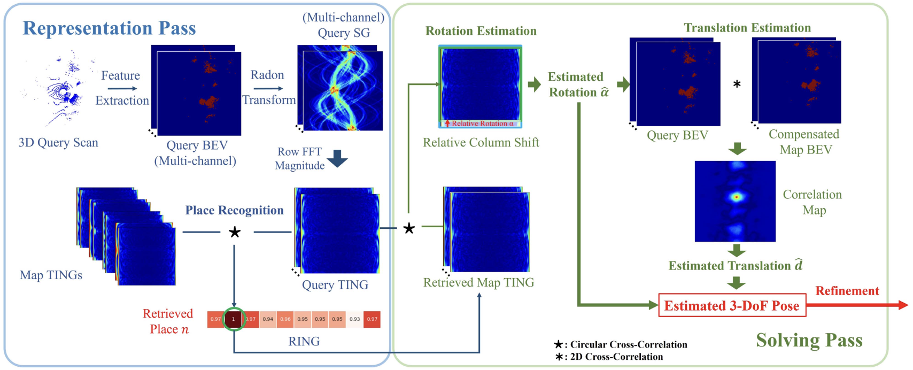

# RING++: Roto-Translation-Invariant Gram for Global Localization on a Sparse Scan Map (IEEE T-RO 2023)
Official implementation of RING and RING++:
* [One RING to Rule Them All: Radon Sinogram for Place Recognition, Orientation and Translation Estimation](https://ieeexplore.ieee.org/document/9981308) (IEEE IROS 2022).
* [RING++: Roto-Translation-Invariant Gram for Global Localization on a Sparse Scan Map](https://ieeexplore.ieee.org/document/10224330) (IEEE T-RO 2023).

## Abstract
Global localization plays a critical role in many robot applications. LiDAR-based global localization draws the community’s focus with its robustness against illumination and seasonal changes. To further improve the localization under large viewpoint differences, we propose RING++ that has roto-translation invariant representation for place recognition and global convergence for both rotation and translation estimation. With the theoretical guarantee, RING++ is able to address the large viewpoint difference using a lightweight map with sparse scans. In addition, we derive sufficient conditions of feature extractors for the representation preserving the roto-translation invariance, making RING++ a framework applicable to generic multichannel features. To the best of our knowledge, this is the first learning-free framework to address all the subtasks of global localization in the sparse scan map. Validations on real-world datasets show that our approach demonstrates better performance than state-of-the-art learning-free methods and competitive performance with learning-based methods. Finally, we integrate RING++ into a multirobot/session simultaneous localization and mapping system, performing its effectiveness in collaborative applications.



## Installation
You can install RING++ locally on your machine, or use the provided Dockerfile to run it in a container. This repository has been tested in the following environments:
* Ubuntu 18.04/20.04
* CUDA 11.1/11.3/11.6
* PyTorch 1.9/1.10/1.12

### Local Installation

1. Install [PyTorch](https://pytorch.org/) > 1.6.0 (make sure to select the correct cuda version)
```bash
pip install torch==1.11.0+cu113 torchvision==0.12.0+cu113 torchaudio==0.11.0 --extra-index-url https://download.pytorch.org/whl/cu113
```
2. Clone this [repo](https://github.com/lus6-Jenny/RING) and install the requirements
```bash
git clone https://github.com/lus6-Jenny/RING.git
cd RING
pip install -r requirements.txt
```
3. Install [generate_bev_occ_cython](https://github.com/lus6-Jenny/RING/tree/main/utils/generate_bev_occ_cython) and [generate_bev_pointfeat_cython](https://github.com/lus6-Jenny/RING/tree/main/utils/generate_bev_pointfeat_cython) to generate BEV representation of point cloud
```bash
# Occpuancy BEV
cd utils/generate_bev_occ_cython
python setup.py install
python test.py
# Point feature BEV
cd utils/generate_bev_pointfeat_cython
python setup.py install
python test.py
```
NOTE: If you meet segmentation fault error, you may have overlarge number of points to process e.g. 67w. To tackle this problem you may need to change your system stack size by ```ulimit -s 81920``` in your bash.

4. Install [torch-radon](https://github.com/matteo-ronchetti/torch-radon) (install v2 for PyTorch > 1.6.0), you can install it from this repo or the original repo
```bash
# git clone https://github.com/matteo-ronchetti/torch-radon.git -b v2; cd torch-radon; python setup.py install
cd utils/torch-radon 
python setup.py install
```
5. Install [fast_gicp](https://github.com/SMRT-AIST/fast_gicp) for fast point cloud registration, you can install it from this repo or the original repo
```bash
# git clone https://github.com/SMRT-AIST/fast_gicp.git --recursive; cd fast_gicp; python setup.py install --user
cd utils/fast_gicp
python setup.py install --user
```
6. Quick [demo](https://github.com/lus6-Jenny/RING/tree/main/test.py) to see how the repo works
```bash
cd RING
# add the path of RING to PYTHONPATH
export PYTHONPATH=$PYTHONPATH:$(pwd) 
python test.py
```

### Docker
Make sure you have installed [Docker](https://docs.docker.com/engine/install/ubuntu/) and [NVIDIA-Docker](https://docs.nvidia.com/datacenter/cloud-native/container-toolkit/install-guide.html#docker) on your machine. 

You can pull the pre-built docker image from dockerhub:
```bash
docker pull lus6/ring:noetic
```
Or you can build the docker image from the Dockerfile by yourself:
1. Build the docker image
```bash
docker build --network host --tag ring:noetic -f Dockerfile .
```
2. Run the docker container
```bash
docker run -itd --gpus all --network host --name ring ring:noetic
```
3. Run the test script in the container
```bash
docker exec -it ring bash
python3 test.py
```

## Datasets
We carry out substantial experiments on four widely used datasets: [NCLT](http://robots.engin.umich.edu/nclt/), [MulRan](https://sites.google.com/view/mulran-pr/dataset), [SemanticKITTI](http://semantic-kitti.org/dataset.html#download) and [Oxford Radar RobotCar](https://oxford-robotics-institute.github.io/radar-robotcar-dataset/). Please download these datasets and put them in the `data` folder, origanized as follows:

```
NCLT Dataset
├── 2012-02-04
│   ├── velodyne_data
│   │   ├── velodyne_sync
│   │   │   ├── xxxxxx.bin
│   │   │   ├── ...
│   ├── ground_truth
│   │   ├── groundtruth_2012-02-04.csv
```

```
MulRan Dataset
├── Sejong01
│   ├── Ouster
│   │   ├── xxxxxx.bin
│   │   ├── ...
│   ├── global_pose.csv
```

```
KITTI Dataset
├── 08
│   ├── velodyne
│   │   ├── xxxxxx.bin
│   │   ├── ...
│   ├── labels
│   ├── times.txt
│   ├── poses.txt
│   ├── calib.txt
```

```
Oxford Radar RobotCar Dataset
├── 2019-01-11-13-24-51
│   ├── velodyne_left
│   │   ├── xxxxxx.png
│   │   ├── ...
│   ├── velodyne_right
│   │   ├── xxxxxx.png
│   │   ├── ...
│   ├── gps.csv
│   ├── ins.csv
├── velodyne_left.txt
├── velodyne_right.txt
```

## Evaluation
### Configuration
The configuration of the evaluation is in `utils/config.py`. You can change the parameters in the configuration file to perform different settings.

### Data Preparation
Generate the evaluation sets for loop closure evaluation. For instance, to generate the evaluation set for the NCLT dataset:
```bash
python evaluation/generate_evaluate_sets.py --dataset nclt --dataset_root ./data/NCLT --map_sequence 2012-02-04 --query_sequence 2012-03-17 --map_sampling_distance 20.0 --query_sampling_distance 5.0 --dist_threshold 20.0
```
where `dataset` is the evaluation dataset (nclt / mulran / kitti / oxford_radar), `dataset_root` is the path of the dataset, `map_sequence` and `query_sequence` are the sequences used as map and query, `map_sampling_distance` and `query_sampling_distance` are the sampling distances for the map and query, and `dist_threshold` is the distance threshold for the ground truth loop closure pairs. After running the script, the evaluation set will be saved in the path of `dataset_root` as a pickle file, for example `./data/NCLT/test_2012-02-04_2012-03-17_20.0_5.0_20.0.pickle`.

### Loop Closure
To evaluate the loop closure performance of RING / RING++, run:
```bash
python evaluation/evaluate.py --dataset nclt --eval_set_filepath ./data/NCLT/test_2012-02-04_2012-03-17_20.0_5.0_20.0.pickle --revisit_thresholds 5.0 10.0 15.0 20.0 --num_k 25 --bev_type occ
```
where `dataset` is the evaluation dataset (nclt / mulran / kitti / oxford_radar), `eval_set_filepath` is the path of the evaluation set, `revisit_thresholds` is the list of revisit thresholds, `num_k` is the number of nearest neighbors for recall@k, and `bev_type` is the type of BEV representation (occ / feat). To evaluate RING, use `--bev_type occ`, and to evaluate RING++, use `--bev_type feat`.

### Plot
To plot the precision-recall curve, run:
```bash
python evaluation/plot_PR_curve.py 
```

To visualize the pose estimation errors, run:
```bash
python evaluation/plot_pose_errors.py 
```
NOTE: You may need to change the path of the results in the script.


## Citation
If you find this work useful, please cite:
```bibtex
@article{xu2023ring++,
  title={RING++: Roto-Translation-Invariant Gram for Global Localization on a Sparse Scan Map},
  author={Xu, Xuecheng and Lu, Sha and Wu, Jun and Lu, Haojian and Zhu, Qiuguo and Liao, Yiyi and Xiong, Rong and Wang, Yue},
  journal={IEEE Transactions on Robotics},
  year={2023},
  publisher={IEEE}
}
```
```bibtex
@inproceedings{lu2023deepring,
  title={DeepRING: Learning Roto-translation Invariant Representation for LiDAR based Place Recognition},
  author={Lu, Sha and Xu, Xuecheng and Tang, Li and Xiong, Rong and Wang, Yue},
  booktitle={2023 IEEE International Conference on Robotics and Automation (ICRA)},
  pages={1904--1911},
  year={2023},
  organization={IEEE}
}
```
```bibtex
@inproceedings{lu2022one,
  title={One ring to rule them all: Radon sinogram for place recognition, orientation and translation estimation},
  author={Lu, Sha and Xu, Xuecheng and Yin, Huan and Chen, Zexi and Xiong, Rong and Wang, Yue},
  booktitle={2022 IEEE/RSJ International Conference on Intelligent Robots and Systems (IROS)},
  pages={2778--2785},
  year={2022},
  organization={IEEE}
}
```

## Contact
If you have any questions, please contact
```
Sha Lu: lusha@zju.edu.cn
```

## License
The code is released under the [MIT License](https://opensource.org/license/mit/).